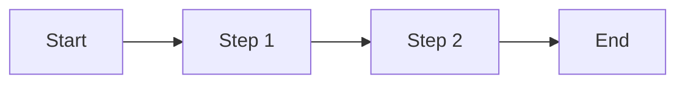
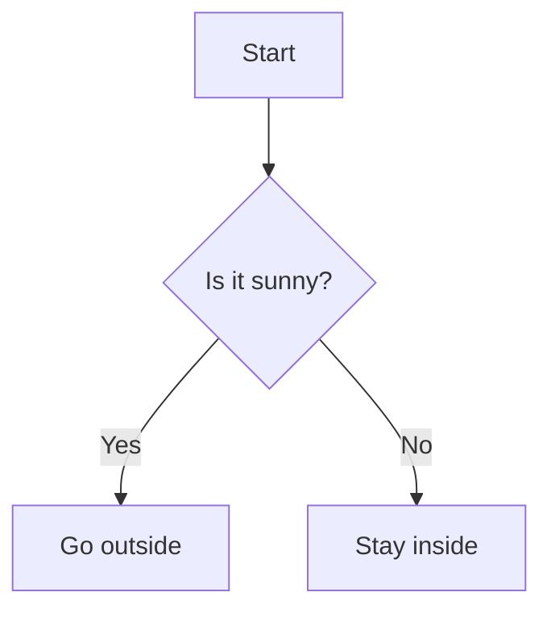
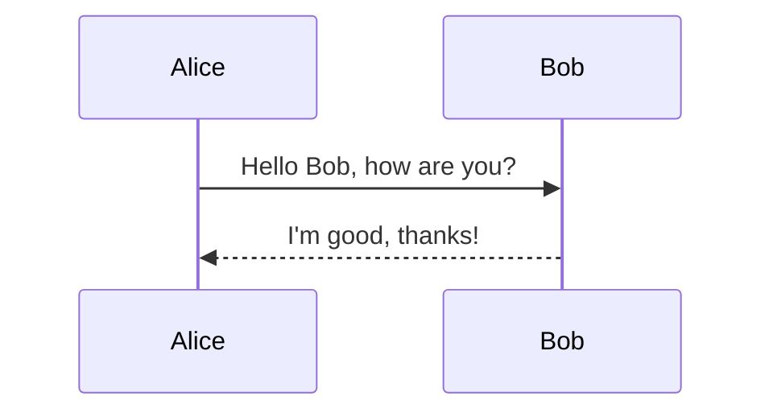

## Simple

```mermaid
graph TD;
  A-->B;
  A-->C;
  B-->D;
  C-->D;
```

```mermaid
graph LR
    A[Start] --> B[Step 1]
    B --> C[Step 2]
    C --> D[End]
```

## Flowchart Example

```mermaid
flowchart TD
    A[Start] --> B{Is it sunny?}
    B -- Yes --> C[Go outside]
    B -- No --> D[Stay inside]
```

## Sequence Diagram Example

```mermaid
sequenceDiagram
    Alice->>Bob: Hello Bob, how are you?
    Bob-->>Alice: I'm good, thanks!
```
